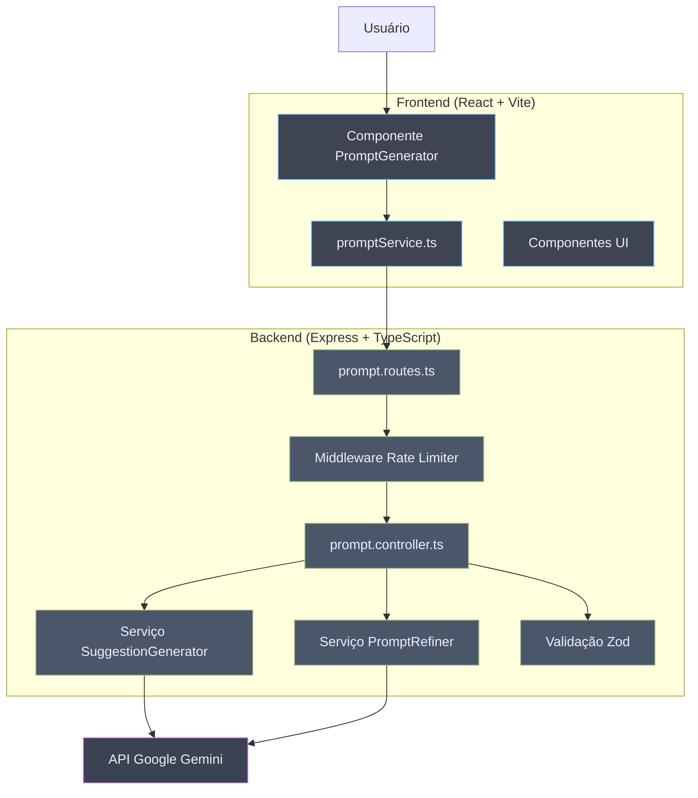

# Intelligent Prompt Creator


**Uma aplicação web full-stack que ajuda usuários a criar prompts otimizados para modelos de IA usando sugestões inteligentes fornecidas pelo Google Gemini.**

---

_[Read in English / Leia em Inglês](README.md)_

---

## O Problema

Criar prompts eficazes para modelos de IA é frequentemente um processo manual e repetitivo. Os usuários frequentemente enfrentam dificuldades como:

- **Estruturar prompts de forma eficaz**: Saber quais elementos tornam um prompt claro e efetivo
- **Tentativa e erro**: Gastar tempo excessivo iterando em prompts para obter os resultados desejados
- **Consistência**: Manter uma abordagem estruturada em diferentes necessidades de prompts
- **Otimização**: Entender como aproveitar as capacidades da IA através de instruções bem elaboradas

O gargalo é sempre o mesmo: criar prompts manualmente sem orientação leva a resultados subótimos e perda de tempo.

## A Solução

O **Intelligent Prompt Creator** foi projetado como uma plataforma guiada de engenharia de prompts. A ferramenta aborda diretamente esses pontos de dor através de:

1. **Geração de sugestões estruturadas**: A IA analisa sua ideia inicial e gera sugestões para cada componente chave de um prompt eficaz (contexto, objetivos, restrições, formato e exemplos)

2. **Seleção interativa**: Os usuários podem revisar e selecionar entre múltiplas opções geradas pela IA para cada seção, personalizando o prompt final de acordo com suas necessidades

3. **Refinamento inteligente**: Os componentes selecionados são montados e refinados pela IA para criar um prompt final coeso e bem estruturado

4. **Opcional "Pense Passo a Passo"**: Os usuários podem ativar o chain-of-thought prompting para encorajar um raciocínio mais detalhado da IA

## Principais Funcionalidades

- **Sugestões Alimentadas por IA**: Utiliza o Google Gemini para gerar sugestões inteligentes e contextuais para cada componente do prompt
- **Framework Estruturado de Prompt**: Guia os usuários através de cinco elementos essenciais: Contexto, Objetivos, Restrições, Formato de Saída e Exemplos
- **Refinamento em Tempo Real**: Monta e aprimora o prompt final usando IA para coerência ótima
- **Rate Limiting**: Proteção integrada com limitação de taxa em duas camadas (por minuto e por dia)
- **Validação de Entrada**: Validação robusta de requisições usando schemas Zod tanto no frontend quanto no backend
- **UI Moderna**: Interface limpa e responsiva construída com React, Tailwind CSS e componentes shadcn/ui
- **Pronto para Docker**: Configuração Docker pronta para produção com builds multi-stage

## Arquitetura



## Instalação e Uso

Siga os passos abaixo para configurar e executar o projeto em sua máquina local.

### Pré-requisitos

- Node.js 22.19 ou superior (use `nvm use` para carregar automaticamente a versão correta)
- npm ou yarn
- Uma chave de API do Google Gemini ([Obtenha aqui](https://aistudio.google.com/apikey))

### Configuração do Ambiente

```bash
# 1. Clone o repositório
git clone https://github.com/armandomonteir-o/intelligent-prompt-creator.git
cd intelligent-prompt-creator

# 2. Use a versão correta do Node
nvm use

# 3. Instale as dependências do backend
cd backend
cp .env.example .env
# Edite o .env e adicione sua GEMINI_API_KEY
npm install

# 4. Instale as dependências do frontend
cd ../frontend
cp .env.example .env.local
npm install
```

### Executando a Aplicação

**Modo Desenvolvimento:**

```bash
# Terminal 1 - Backend
cd backend
npm run dev

# Terminal 2 - Frontend
cd frontend
npm run dev
```

O frontend estará disponível em `http://localhost:5173` e o backend em `http://localhost:3005`.

**Usando Docker:**

```bash
# Desenvolvimento com hot-reload
docker-compose -f docker-compose.dev.yml up

# Produção
docker-compose up
```

### Executando Testes

```bash
# Testes do backend
cd backend
npm test

# Testes do frontend
cd frontend
npm test
```

## Endpoints da API

| Método | Endpoint                   | Descrição                            |
| ------ | -------------------------- | ------------------------------------ |
| `POST` | `/api/prompts/suggestions` | Gera sugestões para seções do prompt |
| `POST` | `/api/prompts/refine`      | Refina e aprimora o prompt montado   |
| `GET`  | `/api/prompts/health`      | Endpoint de verificação de saúde     |

### Limites de Taxa

- **Por minuto**: 3 requisições
- **Por dia**: 15 requisições

## Stack Tecnológica

### Backend

- **Node.js + Express 5**: Framework web moderno com suporte a async/await
- **TypeScript**: Desenvolvimento type-safe com configuração estrita
- **Google Gemini AI**: Alimentado pelo SDK `@google/genai` para sugestões inteligentes
- **Zod**: Validação em tempo de execução para schemas de requisição/resposta
- **Vitest**: Framework de testes unitários rápido

### Frontend

- **React 19**: React mais recente com recursos concorrentes
- **Vite**: Ferramenta de build e servidor de desenvolvimento ultra-rápido
- **TypeScript**: Type safety de ponta a ponta
- **Tailwind CSS**: Estilização utility-first
- **shadcn/ui**: Componentes UI de alta qualidade e acessíveis
- **Vitest + React Testing Library**: Testes de componentes

### DevOps

- **Docker**: Builds multi-stage para imagens otimizadas
- **Docker Compose**: Orquestração para desenvolvimento e produção

## Estrutura do Projeto

```
intelligent-prompt-creator/
├── backend/
│   ├── src/
│   │   ├── controllers/     # Manipuladores de requisição
│   │   ├── services/        # Lógica de negócios (integração IA)
│   │   ├── middlewares/     # Rate limiting, tratamento de erros
│   │   ├── routes/          # Definições de rotas da API
│   │   ├── types/           # Schemas Zod e tipos
│   │   ├── utils/           # Funções auxiliares
│   │   └── templates/       # Templates de prompt para IA
│   ├── Dockerfile
│   └── package.json
├── frontend/
│   ├── src/
│   │   ├── components/      # Componentes React
│   │   │   ├── ui/          # Componentes UI reutilizáveis
│   │   │   └── features/    # Componentes específicos de funcionalidade
│   │   ├── services/        # Cliente da API
│   │   ├── lib/             # Utilitários
│   │   └── types/           # Tipos TypeScript
│   ├── Dockerfile
│   └── package.json
├── docker-compose.yml
├── docker-compose.dev.yml
└── README.md
```

## Licença

Este projeto está licenciado sob a Licença MIT. Veja o arquivo [LICENSE](LICENSE) para detalhes.

## Autor

Desenvolvido por Armando Monteiro.

<a href="https://github.com/armandomonteir-o">
  
</a>

---
