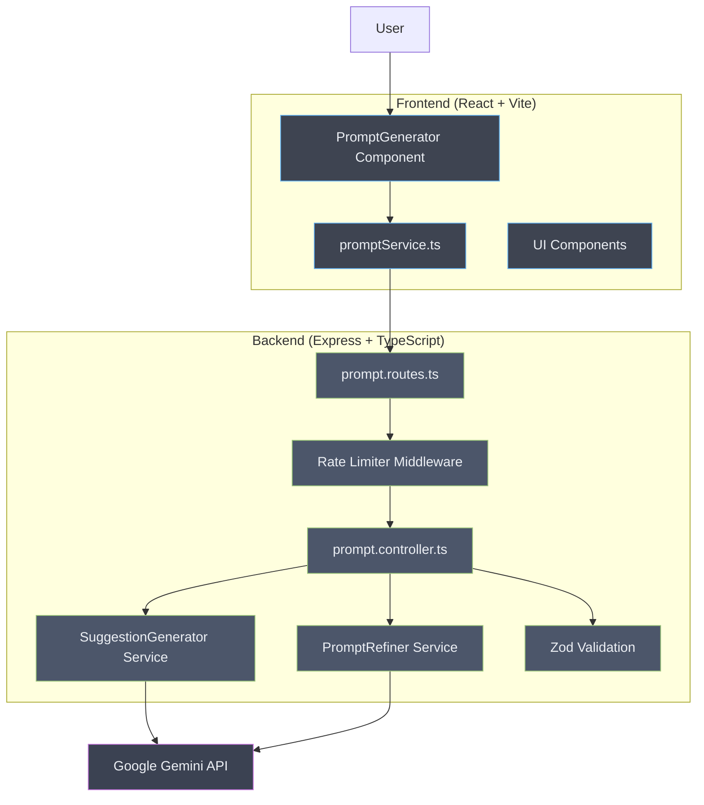

# Intelligent Prompt Creator


**A full-stack web application that helps users create optimized prompts for AI models using intelligent suggestions powered by Google Gemini.**

---

_[Leia em Português / Read in Portuguese](README-PT.md)_

---

## The Problem

Creating effective prompts for AI models is often a manual and repetitive process. Users frequently struggle with:

- **Structuring prompts effectively**: Knowing what elements make a prompt clear and actionable
- **Trial and error**: Spending excessive time iterating on prompts to get desired results
- **Consistency**: Maintaining a structured approach across different prompt needs
- **Optimization**: Understanding how to leverage AI capabilities through well-crafted instructions

The bottleneck is always the same: manually crafting prompts without guidance leads to suboptimal results and wasted time.

## The Solution

**Intelligent Prompt Creator** was designed as a guided prompt engineering platform. The tool directly addresses these pain points by:

1. **Generating structured suggestions**: The AI analyzes your initial idea and generates suggestions for each key component of an effective prompt (context, objectives, constraints, format, and examples)

2. **Interactive selection**: Users can review and select from multiple AI-generated options for each section, customizing the final prompt to their needs

3. **Intelligent refinement**: The selected components are assembled and refined by AI to create a cohesive, well-structured final prompt

4. **Optional "Think Step-by-Step"**: Users can enable chain-of-thought prompting to encourage more detailed AI reasoning

## Key Features

- **AI-Powered Suggestions**: Leverages Google Gemini 2.0 Flash to generate intelligent, context-aware suggestions for each prompt component
- **Structured Prompt Framework**: Guides users through five essential prompt elements: Context, Objectives, Constraints, Output Format, and Examples
- **Real-time Refinement**: Assembles and polishes the final prompt using AI for optimal coherence
- **Rate Limiting**: Built-in protection with dual-tier rate limiting (per-minute and per-day limits)
- **Input Validation**: Robust request validation using Zod schemas on both frontend and backend
- **Modern UI**: Clean, responsive interface built with React, Tailwind CSS, and shadcn/ui components
- **Docker Ready**: Production-ready Docker configuration with multi-stage builds

## Architecture



## Installation and Usage

Follow the steps below to set up and run the project on your local machine.

### Prerequisites

- Node.js 22.19 or higher (use `nvm use` to automatically load the correct version)
- npm or yarn
- A Google Gemini API key ([Get one here](https://aistudio.google.com/apikey))

### Environment Setup

```bash
# 1. Clone the repository
git clone https://github.com/armandomonteir-o/intelligent-prompt-creator.git
cd intelligent-prompt-creator

# 2. Use the correct Node version
nvm use

# 3. Install backend dependencies
cd backend
cp .env.example .env
# Edit .env and add your GEMINI_API_KEY
npm install

# 4. Install frontend dependencies
cd ../frontend
cp .env.example .env.local
npm install
```

### Running the Application

**Development Mode:**

```bash
# Terminal 1 - Backend
cd backend
npm run dev

# Terminal 2 - Frontend
cd frontend
npm run dev
```

The frontend will be available at `http://localhost:5173` and the backend at `http://localhost:3005`.

**Using Docker:**

```bash
# Development with hot-reload
docker-compose -f docker-compose.dev.yml up

# Production
docker-compose up
```

### Running Tests

```bash
# Backend tests
cd backend
npm test

# Frontend tests
cd frontend
npm test
```

## API Endpoints

| Method | Endpoint | Description |
|--------|----------|-------------|
| `POST` | `/api/prompts/suggestions` | Generate suggestions for prompt sections |
| `POST` | `/api/prompts/refine` | Refine and polish the assembled prompt |
| `GET` | `/api/prompts/health` | Health check endpoint |

### Rate Limits

- **Per minute**: 3 requests
- **Per day**: 15 requests

## Tech Stack

### Backend
- **Node.js + Express 5**: Modern web framework with async/await support
- **TypeScript**: Type-safe development with strict configuration
- **Google Gemini AI**: Powered by `@google/genai` SDK for intelligent suggestions
- **Zod**: Runtime validation for request/response schemas
- **Vitest**: Fast unit testing framework

### Frontend
- **React 19**: Latest React with concurrent features
- **Vite**: Lightning-fast build tool and dev server
- **TypeScript**: End-to-end type safety
- **Tailwind CSS**: Utility-first styling
- **shadcn/ui**: High-quality, accessible UI components
- **Vitest + React Testing Library**: Component testing

### DevOps
- **Docker**: Multi-stage builds for optimized images
- **Docker Compose**: Orchestration for development and production

## Project Structure

```
intelligent-prompt-creator/
├── backend/
│   ├── src/
│   │   ├── controllers/     # Request handlers
│   │   ├── services/        # Business logic (AI integration)
│   │   ├── middlewares/     # Rate limiting, error handling
│   │   ├── routes/          # API route definitions
│   │   ├── types/           # Zod schemas and types
│   │   ├── utils/           # Helper functions
│   │   └── templates/       # Prompt templates for AI
│   ├── Dockerfile
│   └── package.json
├── frontend/
│   ├── src/
│   │   ├── components/      # React components
│   │   │   ├── ui/          # Reusable UI components
│   │   │   └── features/    # Feature-specific components
│   │   ├── services/        # API client
│   │   ├── lib/             # Utilities
│   │   └── types/           # TypeScript types
│   ├── Dockerfile
│   └── package.json
├── docker-compose.yml
├── docker-compose.dev.yml
└── README.md
```

## License

This project is licensed under the MIT License. See the [LICENSE](LICENSE) file for details.

## Author

Developed by Armando Monteiro.

<a href="https://github.com/armandomonteir-o">
  
</a>

---
